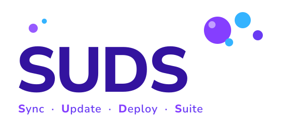

<p align="center">
  
</p>

<p align="center"><em>Sync. Update. Deploy. Suite.</em></p>

<p align="center">

[](https://github.com/Bounteous-Inc/suds/actions/workflows/ci.yml)
[](https://packagist.org/packages/bounteous-inc/suds)
[](composer.json)
[](LICENSE)

</p>

An opinionated orchestrator for Drupal development workflows, implemented as [Drush](https://www.drush.org) commands. Inspired by the [Acquia BLT](https://github.com/acquia/blt) project.

SUDS gives every developer on a project — and every CI pipeline — the same commands for the same tasks. Syncing a database, deploying a build artifact, applying updates after a pull: the answers are always `drush suds:sync`, `drush suds:deploy`, `drush suds:update`, regardless of which project you are working on.

## How it works

SUDS is built around two workflows.

**Local development sync** — `suds:sync` pulls a database from a configured source environment, installs Composer dependencies, sanitizes PII from the local database, optionally syncs managed files, and applies pending updates (cache rebuild, database updates, configuration import) in a single command. New developers get a working local environment in one step; existing developers stay current with the same command.

**Artifact deployment** — `suds:deploy` assembles a production-ready artifact from the project source: it rsyncs the project into a clean directory, runs configured build steps (asset compilation, etc.), commits the result, and force-pushes to a deployment repository. Hosting platforms that deploy from a git repository receive a clean artifact that contains only what production needs — no build tooling, test files, or local configuration.

Both workflows are driven by `suds.yml` in the project root. One file, committed to the repository, defines the workflow for the entire team.

## Requirements

- PHP 8.3 or later
- Drush 13
- Drupal 10.4 or 11

## Installation

Install SUDS via Composer:

```bash
composer require bounteous-inc/suds
```

SUDS belongs in `require`, not `require-dev`. Like Drush itself, it is an operational tool: `suds:update` runs on production servers, `suds:deploy` runs in CI pipelines, and both need to be present in the deployed vendor directory. Adding it to `require-dev` would exclude it from artifact builds and break server-side execution.

Drush discovers the commands automatically via the `extra.drush.services` entry in `composer.json`. No additional registration is needed.

## Getting started

**Adding SUDS to a new project:**

```bash
composer require bounteous-inc/suds
drush suds:init    # creates suds.yml and prompts for a project name
drush suds:doctor  # verifies the environment is correctly configured
```

Edit the generated `suds.yml` to set your deployment repository URL and default sync source, then commit it. See [Configuration](#configuration) for available keys.

**Onboarding a new developer to an existing project:**

```bash
git clone <project-repo>
cd <project>
composer install       # the only manual bootstrap step
drush suds:doctor      # verify the environment
drush suds:sync @dev
```

After the initial `composer install`, `suds:sync` runs it automatically on every subsequent sync so dependencies stay current as the project evolves.

## Configuration

SUDS configuration lives in `suds.yml` in the project root. You only need to define values that differ from the defaults — `drush suds:config:dump --defaults` shows every available key with its built-in default value, and `drush suds:config:dump` shows the resolved configuration for the current project. Individual keys can be inspected directly: `drush suds:config:dump sync.db.export_dir`.

### The merge chain

Configuration is assembled from four layers in order, each overriding the previous:

| Layer | File | Committed | Purpose |
|---|---|---|---|
| Built-in defaults | _(shipped with SUDS)_ | — | All keys and their default values |
| Project config | `suds.yml` | Yes | Shared team configuration |
| CI overrides | `suds.ci.yml` | Yes | Loaded only when the `$CI` environment variable is set |
| Local overrides | `suds.local.yml` | No | Per-developer overrides — add to `.gitignore` |

### Merge semantics

Associative (keyed) values merge recursively. A partial override in `suds.yml` preserves all other keys in that section — you do not need to repeat values you are not changing:

```yaml
# suds.yml — only override what differs from the defaults
drupal:
  root: docroot   # overrides the default 'web'; drupal.profile is untouched
```

Lists (indexed arrays) replace entirely. To add paths to the artifact exclusion list without discarding the built-in defaults, use `deploy.exclude_extra` rather than `deploy.exclude`:

```yaml
deploy:
  exclude_extra:
    - private/
    - secrets.txt
```

### CI configuration

`suds.ci.yml` is intended for values that should only apply in CI — typically deploy identity and any environment-specific overrides. It is committed to the repository and excluded from the artifact by default:

```yaml
# suds.ci.yml
deploy:
  git:
    name: 'My CI Pipeline'
    email: 'ci@example.com'
```

## Hooks

Every orchestration command exposes pre and post hooks — lists of shell commands that run at defined points in the workflow. Hooks are configured in `suds.yml` and run in the project root (build steps in `suds:deploy` run in the artifact directory instead).

**Execution context matters for `suds:update` hooks.** Update hooks run wherever `suds:update` executes — on the server when invoked via a remote alias (see [`suds:update`](#sudsupdate)), or locally when invoked directly. Use `update.hooks` for operations that belong on the target environment: toggling maintenance mode, triggering a search index rebuild, sending a deployment notification from the server. Use `deploy.hooks.post_deploy` for operations that must run on the CI machine after the push: triggering downstream pipelines, posting to a chat webhook from a CI secret, or invalidating a CDN cache via an API key that only CI holds.

| Command | Hooks |
|---|---|
| `suds:setup` | `setup.hooks.pre_setup`, `setup.hooks.post_setup` |
| `suds:sync` | `sync.hooks.pre_sync`, `sync.hooks.post_sync` |
| `suds:update` | `update.hooks.pre_update`, `update.hooks.post_update` |
| `suds:deps-update` | `deps_update.hooks.pre_deps_update`, `deps_update.hooks.post_deps_update` |
| `suds:deploy` | `deploy.hooks.pre_deploy`, `deploy.hooks.post_deploy` |

**Example: configure local settings and seed content after a sync**

```yaml
sync:
  hooks:
    post_sync:
      - cp .env.example .env.local
      - drush config:set system.site name "Local Dev" --yes
```

**Example: validate, build assets, and notify after a deploy**

```yaml
deploy:
  build_steps:
    - npm ci
    - npm run build
  hooks:
    pre_deploy:
      - composer validate:all
    post_deploy:
      - curl -X POST https://hooks.example.com/deploy-notification
```

### Environment variables in deploy hooks

The following variables are set automatically before any `suds:deploy` hooks or build steps run. They are also available in `deploy.repo.branch` and `deploy.commit_message`:

| Variable | Value |
|---|---|
| `$SUDS_BRANCH` | Current git branch name |
| `$SUDS_HASH` | Full HEAD commit SHA |
| `$SUDS_SHORT_HASH` | First 8 characters of HEAD SHA |

```yaml
deploy:
  commit_message: "Deploy $SUDS_BRANCH [$SUDS_SHORT_HASH]"
  repo:
    branch: "$SUDS_BRANCH-build"
```

## Commands

All commands are prefixed with `suds:` and have `su-` short aliases.

### `suds:config:dump`

Display the resolved project configuration (defaults merged with `suds.yml` overrides).

```bash
# Show resolved config for the current project
drush suds:config:dump

# Show the value of a single key (dot-notation)
drush suds:config:dump sync.db.export_dir

# Show built-in defaults only, ignoring suds.yml
drush suds:config:dump --defaults
```

| Argument | Description |
|---|---|
| `key` | Dot-notation key to inspect (e.g. `sync.db.export_dir`). When omitted, the full config tree is shown. |

| Option | Default | Description |
|---|---|---|
| `--defaults` | disabled | Show built-in default values only, ignoring `suds.yml` |

### `suds:init`

Initialize a new SUDS-managed Drupal project by creating `suds.yml`. Also runs `suds:scaffold:quality` unless `--skip-quality-scaffold` is passed.

```bash
# Interactive — prompts for the project name and uses auto-detected webroot
drush suds:init

# Non-interactive — suitable for CI
drush suds:init --name="My Project" --drupal-root=web

# Skip quality tooling scaffolding
drush suds:init --skip-quality-scaffold
```

| Option | Default | Description |
|---|---|---|
| `--name` | (prompt) | Project name; skips the interactive prompt when provided |
| `--drupal-root` | (auto-detect or prompt) | Drupal webroot directory relative to the project root; auto-detected from `web/`, `docroot/`, or `html/` when omitted |
| `--skip-quality-scaffold` | disabled | Skip scaffolding quality tool config files |

### `suds:scaffold:quality`

Scaffold code quality configuration files into the project root: `grumphp.yml`, `phpcs.xml.dist`, and `phpstan.neon`. Files are pre-configured for a Drupal site with custom modules and themes under the configured webroot. Existing files are left untouched unless `--force` is passed.

`suds:init` runs this command automatically. Use it directly to add quality tooling to an existing project, or to regenerate files after deleting them.

```bash
# Scaffold using drupal.root from suds.yml
drush suds:scaffold:quality

# Scaffold with an explicit webroot
drush suds:scaffold:quality --drupal-root=docroot

# Overwrite any existing quality tool config files
drush suds:scaffold:quality --force
```

After scaffolding, require the quality tooling dependencies:

```bash
composer require --dev phpro/grumphp squizlabs/php_codesniffer drupal/coder dealerdirect/phpcodesniffer-composer-installer phpstan/phpstan mglaman/phpstan-drupal phpstan/phpstan-deprecation-rules ergebnis/composer-normalize vincentlanglet/twig-cs-fixer
```

GrumPHP's composer plugin installs pre-commit and commit-msg git hooks automatically on `composer install`.

| Option | Default | Description |
|---|---|---|
| `--drupal-root` | (read from `suds.yml`) | Drupal webroot directory; overrides `drupal.root` from `suds.yml` |
| `--force` | disabled | Overwrite files that already exist |

The scaffolded configuration includes:

- **GrumPHP** — runs composer validation, PHP_CodeSniffer, PHPStan, YAML linting, Twig CS, a debug-artifact blacklist, and Conventional Commits enforcement on every commit.
- **PHP_CodeSniffer** — `Drupal` + `DrupalPractice` standards scoped to `modules/custom` and `themes/custom`.
- **PHPStan** — level 6 with `mglaman/phpstan-drupal` and `phpstan/phpstan-deprecation-rules`.

### `suds:scaffold:ci`

Scaffold a CI pipeline and `suds.ci.yml` into the project root. The pipeline installs Composer dependencies and runs GrumPHP quality checks. A commented deploy block shows how to wire up `suds:deploy` for automated artifact pushes. Existing files are left untouched unless `--force` is passed.

Supported providers:

| Provider | Files written |
|---|---|
| `github` | `.github/workflows/ci.yml`, `suds.ci.yml` |
| `gitlab` | `.gitlab-ci.yml`, `suds.ci.yml` |
| `bitbucket` | `bitbucket-pipelines.yml`, `suds.ci.yml` |

```bash
# Scaffold a GitHub Actions workflow
drush suds:scaffold:ci github

# Scaffold a GitLab CI configuration
drush suds:scaffold:ci gitlab

# Scaffold a Bitbucket Pipelines configuration
drush suds:scaffold:ci bitbucket

# Overwrite any existing CI files
drush suds:scaffold:ci github --force
```

The PHP version is detected automatically from `composer.json` (`config.platform.php` takes priority over `require.php`). Falls back to `8.3` when neither is set.

`suds.ci.yml` is loaded automatically by SUDS when the `CI` environment variable is set (standard in all three providers). Use it to override deploy git identity or other settings that differ between local and CI environments.

| Option | Default | Description |
|---|---|---|
| `--force` | disabled | Overwrite files that already exist |

Run `suds:scaffold:quality` first — the generated pipeline assumes `grumphp.yml` is present.

### `suds:doctor`

Validate the local environment for use with SUDS. Checks required tools, configuration presence, and project structure. Exits non-zero if any required check fails.

```bash
drush suds:doctor
```

| Status | Meaning |
|---|---|
| `[OK]` | Check passed |
| `[WARN]` | Non-critical issue — tool still functions |
| `[FAIL]` | Required check failed — exits non-zero |

Checks performed:

| Check | Failure level | Notes |
|---|---|---|
| `composer` available | FAIL | Required for `suds:sync` |
| `rsync` available | WARN | Required for `suds:files:sync` |
| `git` available | WARN | Required for `suds:deploy` |
| PHP >= 8.3 | FAIL | |
| `suds.yml` found | WARN | Run `drush suds:init` to create one |
| `project.name` set | WARN | |
| `drupal.root` directory exists | FAIL | |
| `drupal.root/core` exists | FAIL | Root dir found but not a Drupal installation |
| `deploy.repo.url` set | WARN | Only checked when `git` is available |
| `sync.default_source` set | WARN | `suds:sync` will require an explicit alias on every call |
| Config keys valid | WARN | Unknown key found in `suds.yml` — likely a typo; run `suds:config:dump --defaults` to see all valid keys |
| Config types valid | WARN | Config value has wrong type (e.g. string where bool expected); run `suds:config:dump --defaults` to see expected types |
| Sync alias defined | WARN | Configured sync source alias is not defined in Drush alias files |
| Project root is a git repo | WARN | Only checked when `deploy.repo.url` is set; `suds:deploy` requires a git repository |
| `grumphp.yml` found | WARN | Run `drush suds:scaffold:quality` to create it |
| `phpcs.xml.dist` found | WARN | Run `drush suds:scaffold:quality` to create it |
| `phpstan.neon` found | WARN | Run `drush suds:scaffold:quality` to create it |
| GrumPHP pre-commit hook installed | WARN | Only checked when `grumphp.yml` exists; run `composer install` to let GrumPHP auto-install hooks |

### `suds:setup`

Set up a Drupal site — install dependencies, configure settings, and run the installer.

```bash
# Use the default installation profile (minimal)
drush suds:setup

# Specify a profile
drush suds:setup --profile=standard
```

| Option | Default | Description |
|---|---|---|
| `--profile` | `minimal` | Drupal installation profile to use |
| `--existing-config` | disabled | Install from existing configuration |

| Config key | Default | Description |
|---|---|---|
| `drupal.profile` | `minimal` | Installation profile (overridden by `--profile`) |
| `setup.recipes` | `[]` | Drupal recipes to apply after install, in order |
| `setup.hooks.pre_setup` | `[]` | Commands run before `drush site:install` |
| `setup.hooks.post_setup` | `[]` | Commands run after recipes are applied |

### `suds:sync`

Orchestrate a full environment sync in sequence:

1. Run `sync.hooks.pre_sync` commands
2. `composer install` — install/update PHP dependencies
3. `suds:db:sync` — pull the database from source
4. `suds:db:sanitize` — scrub PII from the local database (skippable)
5. `suds:files:sync` — pull managed files from source (opt-in)
6. `suds:update` — rebuild caches, run DB updates, import config
7. Run `sync.hooks.post_sync` commands

```bash
# Sync database from production (sanitize per config, no files by default)
drush suds:sync @prod

# Sync database and files from production
drush suds:sync @prod --force-files

# Sync without sanitizing the database
drush suds:sync @prod --skip-sanitize

# Import a local backup instead of pulling from a remote alias
drush suds:sync --file=/path/to/backup.sql.gz

# Import the most recent export from sync.db.export_dir
drush suds:sync --latest
```

The `source` argument is optional when a default source is configured in `suds.yml`, or when `--file` or `--latest` is used.
Source resolution priority: CLI argument > `sync.db.default_source` / `sync.files.default_source` > `sync.default_source`.

| Argument | Description |
|---|---|
| `source` | Site alias of the source environment (e.g. `@prod`). Not required when `--file` or `--latest` is used. |

| Option | Default | Description |
|---|---|---|
| `--skip-sanitize` | disabled | Skip database sanitization regardless of config |
| `--force-files` | disabled | Force files sync even when `sync.files.enabled: false` |
| `--skip-files` | disabled | Skip files sync even when `sync.files.enabled: true` |
| `--file` | _(empty)_ | Path to a local `.sql` or `.sql.gz` backup to import instead of pulling from a remote |
| `--latest` | disabled | Import the most recent file from `sync.db.export_dir` instead of pulling from a remote |

| Config key | Default | Description |
|---|---|---|
| `sync.default_source` | `~` | Fallback source alias for all sync steps |
| `sync.db.default_source` | `~` | Source alias for the db step; overrides `sync.default_source` |
| `sync.files.default_source` | `~` | Source alias for the files step; overrides `sync.default_source` |
| `sync.hooks.pre_sync` | `[]` | Commands to run before any sync steps |
| `sync.hooks.post_sync` | `[]` | Commands to run after all sync steps complete |

### `suds:update`

Apply code updates to a Drupal environment: rebuild caches, run database updates, and import configuration.

```bash
# Run locally
drush suds:update

# Run on a remote environment via a Drush site alias (CI/CD post-deploy step)
drush @prod suds:update
```

Configuration import runs twice to handle modules that alter configuration during import (e.g. `config_split`). The second pass is a near-instant no-op when nothing remains.

**Post-deploy usage.** The standard CI/CD pattern is to run `suds:deploy` to push the artifact, then `drush @prod suds:update` to apply it. When Drush resolves `@prod` it SSHes to the production server and executes `suds:update` there — caches are rebuilt, database updates run, and configuration is imported on the actual server. The update hooks (`pre_update`, `post_update`) run on the server as well, making them the right place for operations that require server-side context (toggling maintenance mode, triggering a search index rebuild after deployment). See the [Hooks](#hooks) section for guidance on what belongs in update hooks versus `deploy.hooks.post_deploy`.

```yaml
# suds.yml — example update hooks for a CI/CD post-deploy workflow
update:
  hooks:
    pre_update:
      - drush state:set system.maintenance_mode 1 --input-format=integer --yes
    post_update:
      - drush state:set system.maintenance_mode 0 --input-format=integer --yes
      - drush search-api:index
```

**Site UUID mismatches.** Drupal refuses to import configuration when the site's UUID differs from the one recorded in `system.site.yml` in the config sync directory, because a mismatch normally means the configuration was exported from a *different site*. Since `config:import` also deletes configuration absent from the source, silently overwriting the UUID would suppress the very signal that prevents one site's config being imported over another. `suds:update` therefore stops with an explanation of the likely causes and how to proceed. The check runs before database updates are applied, so an aborted update leaves the database untouched rather than half-updated.

The usual cause is installing fresh instead of installing from the committed configuration. Prefer fixing that at the source:

```bash
drush suds:setup --existing-config
```

Where config sync is genuinely authoritative — for example ephemeral CI environments that install fresh and are then brought up to date from config — opt into automatic reconciliation:

```yaml
# suds.yml
update:
  reconcile_site_uuid: true
```

```bash
# Or for a single run
drush suds:update --reconcile-site-uuid
```

| Option | Default | Description |
|---|---|---|
| `--reconcile-site-uuid` | disabled | Overwrite a mismatched site UUID with the config sync value instead of failing |

| Config key | Default | Description |
|---|---|---|
| `update.reconcile_site_uuid` | `false` | Overwrite the site UUID with the config sync value when they differ, instead of failing |
| `update.hooks.pre_update` | `[]` | Commands to run before caches, DB updates, and config import |
| `update.hooks.post_update` | `[]` | Commands to run after caches, DB updates, and config import complete |

### `suds:deps-update`

Routine maintenance: update Composer dependencies, apply database updates, rebuild caches, and export any resulting config drift so it isn't left uncommitted.

```bash
drush suds:deps-update
```

This is distinct from `suds:update`: `suds:update` imports config into a deployed environment and runs after every artifact deployment regardless of whether dependencies changed, while `suds:deps-update` runs outward from a dev environment to prepare a commit (`composer.lock` + config changes) for review. The two are not otherwise related, which is why `suds:deps-update` isn't namespaced under `update`.

By default, Composer updates run in two passes — Drupal core first, then contrib — configured as groups in `deps_update.composer.groups`. Each inner list is one `composer update` pass, run in order:

```yaml
# suds.yml
deps_update:
  composer:
    groups:
      - ['drupal/core-recommended', 'drupal/core-dev', 'drupal/core-composer-scaffold']
      - ['drupal/*']
```

Pass a `packages` argument to scope a single ad hoc run instead, overriding the configured groups entirely:

```bash
drush suds:deps-update drupal/core-recommended,drupal/core-dev
```

```bash
# Update dependencies without exporting configuration
drush suds:deps-update --skip-cex
```

| Option | Default | Description |
|---|---|---|
| `--skip-cex` | disabled | Skip the config export step regardless of config |

| Config key | Default | Description |
|---|---|---|
| `deps_update.composer.groups` | core, then `drupal/*` | Packages to update, grouped into ordered `composer update` passes |
| `deps_update.skip_config_export` | `false` | Skip the config export step regardless of the `--skip-cex` flag |
| `deps_update.hooks.pre_deps_update` | `[]` | Commands to run before any composer update pass |
| `deps_update.hooks.post_deps_update` | `[]` | Commands to run after config export completes |

### `suds:db:export`

Export the local database to a timestamped gzipped file in the configured export directory.

```bash
drush suds:db:export
```

Exports are written to `sync.db.export_dir` (default: `db-exports/`) as `YYYY-MM-DD-HH-MM.sql.gz`. Add this directory to `.gitignore`.

Project-specific dump flags that your environment requires — such as `--single-transaction` for InnoDB tables — are set once in `suds.yml` via `sync.db.dump_extra_flags` so every developer gets the same result without needing to remember the incantation.

| Config key | Default | Description |
|---|---|---|
| `sync.db.export_dir` | `db-exports` | Directory (relative to project root) for exported dumps |
| `sync.db.dump_extra_flags` | _(empty)_ | Extra flags appended verbatim to `drush sql:dump` (e.g. `--extra-dump=--single-transaction`) |

### `suds:db:sync`

Sync the database from a source environment to `@self`, import from a local file, or import the most recent export.

```bash
# Pull from a remote alias
drush suds:db:sync @prod

# Import a specific local backup (drops and reimports)
drush suds:db:sync --file=/path/to/backup.sql.gz

# Import the most recent file from sync.db.export_dir
drush suds:db:sync --latest
```

| Option | Description |
|---|---|
| `--file` | Path to a local `.sql` or `.sql.gz` file to import. Source alias not required. |
| `--latest` | Import the most recent file from `sync.db.export_dir`. Source alias not required. |

When no source alias is given and neither `--file` nor `--latest` is set, the command falls back to `sync.db.default_source`, then `sync.default_source`. If neither is configured, the command exits non-zero with an explanatory message.

### `suds:db:sanitize`

Sanitize the local database: truncate cache/flood tables, then scrub PII via `drush sql:sanitize`.

```bash
drush suds:db:sanitize
```

Sanitization behaviour is controlled by `sync.db.*` keys in `suds.yml`:

| Config key | Default | Description |
|---|---|---|
| `sync.db.truncate_tables` | Drupal cache/flood/session tables | Tables to truncate before sanitization. Set to `[]` to skip truncation entirely |
| `sync.db.sanitize_email` | `user+%uid@localhost` | Email pattern used by `drush sql:sanitize`. `%uid` is replaced with the user ID |
| `sync.db.sanitize_password` | `password` | Password value applied to all user accounts by `drush sql:sanitize` |

### `suds:files:sync`

Sync files from a source environment to `@self` for each path listed in `sync.files.paths`.

```bash
drush suds:files:sync @prod
```

| Config key | Default | Description |
|---|---|---|
| `sync.files.paths` | `['sites/default/files']` | Directories to sync, relative to `drupal.root` |
| `sync.files.default_source` | `~` | Source alias for the files step; falls back to `sync.default_source` when not set |

### `suds:deploy`

Build a production artifact and push it to a deployment (build) repository.

Assembles a clean artifact directory via rsync, runs build steps, commits the result, and force-pushes to the configured deployment repository. Intended for CI/CD pipelines.

```bash
drush suds:deploy

# Print all commands that would run without executing them
drush suds:deploy --dry-run

# Deploy and create a tag on the artifact repository
drush suds:deploy --tag=v1.2.3
```

| Option | Default | Description |
|---|---|---|
| `--dry-run` | disabled | Print commands that would run without executing them |
| `--tag` | _(none)_ | Create and push a git tag on the artifact repository after the branch push |

**Execution order:**

1. Run `deploy.hooks.pre_deploy` commands in the project root
2. Rsync project into a fresh artifact directory (honouring `deploy.exclude`)
3. Run `deploy.build_steps` commands in the artifact directory
4. Write build manifest to artifact root (when `deploy.manifest: true`)
5. Commit and force-push to `deploy.repo.branch`
6. Create and push `--tag` on the artifact repository (when `--tag` is provided)
7. Run `deploy.hooks.post_deploy` commands in the project root

| Config key | Default | Description |
|---|---|---|
| `deploy.repo.url` | `~` | URL of the deployment repository. **Required.** |
| `deploy.repo.branch` | `$SUDS_BRANCH-build` | Branch to push the artifact to |
| `deploy.commit_message` | `Deploy $SUDS_BRANCH [$SUDS_SHORT_HASH]` | Artifact commit message |
| `deploy.git.name` | `SUDS Deploy` | Git `user.name` for the artifact commit |
| `deploy.git.email` | `suds@localhost` | Git `user.email` for the artifact commit |
| `deploy.build_steps` | `['composer install --no-dev --optimize-autoloader']` | Shell commands run in the artifact directory, in order |
| `deploy.manifest` | `true` | Write a `SUDS_BUILD.txt` manifest file to the artifact root before committing |
| `deploy.manifest_file` | `SUDS_BUILD.txt` | Filename for the build manifest (relative to artifact root) |
| `deploy.exclude` | *(see defaults)* | Paths excluded from the artifact. Overrides the entire default list. |
| `deploy.exclude_extra` | `[]` | Additional paths to exclude, appended to `deploy.exclude`. |
| `deploy.hooks.pre_deploy` | `[]` | Commands run on the CI machine before artifact assembly |
| `deploy.hooks.post_deploy` | `[]` | Commands run on the CI machine after the push completes |

**Build steps.** The default `build_steps` runs `composer install --no-dev --optimize-autoloader` in the artifact directory, producing a production vendor tree without development dependencies. To add frontend asset compilation, append to `build_steps` — the default entry is just the first step in the list:

```yaml
deploy:
  build_steps:
    - composer install --no-dev --optimize-autoloader
    - npm ci
    - npm run build
```

**Build manifest.** When `deploy.manifest` is enabled (the default), SUDS writes a small text file to the artifact root before committing. The manifest records the branch, full commit hash, short hash, and build timestamp — useful for auditing which source commit is running on any server:

```
branch: main
hash: a1b2c3d4e5f6...
short_hash: a1b2c3d4
built_at: 2026-03-19T12:00:00+00:00
```

## Multi-site

SUDS is designed for single-site projects. There is no built-in concept of multiple sites within one `suds.yml`.

For multi-site Drupal installations, SUDS commands can be targeted at a specific site using Drush's standard mechanisms:

**Site alias prefix** — prefix any command with a site alias and SUDS will run all child commands in that site's context:

```bash
drush @myproject.site1 suds:sync @prod
drush @myproject.site2 suds:update
```

**`--uri` flag** — pass `--uri` directly; SUDS forwards it to every child Drush process:

```bash
drush --uri=http://site1.local suds:sync @prod
```

**Hook-based orchestration** — for workflows that need to touch multiple sites in sequence, `post_sync` and `post_update` hooks can issue site-specific Drush calls directly:

```yaml
# suds.yml
sync:
  hooks:
    post_sync:
      - drush @myproject.site2 sql:sync @prod @self
      - drush @myproject.site2 suds:update
```

Note that `suds.yml` configuration keys such as `sync.default_source` and `sync.files.paths` are single-site values. When targeting multiple sites you will typically pass the source alias explicitly on each invocation rather than relying on configured defaults.

## Contributing

See [CONTRIBUTING.md](CONTRIBUTING.md) for setup instructions, coding standards, commit message conventions, and how to submit a pull request.

## Security

To report a vulnerability, see [SECURITY.md](SECURITY.md).

## License

GPL-2.0-or-later. See [LICENSE](LICENSE) for details.
